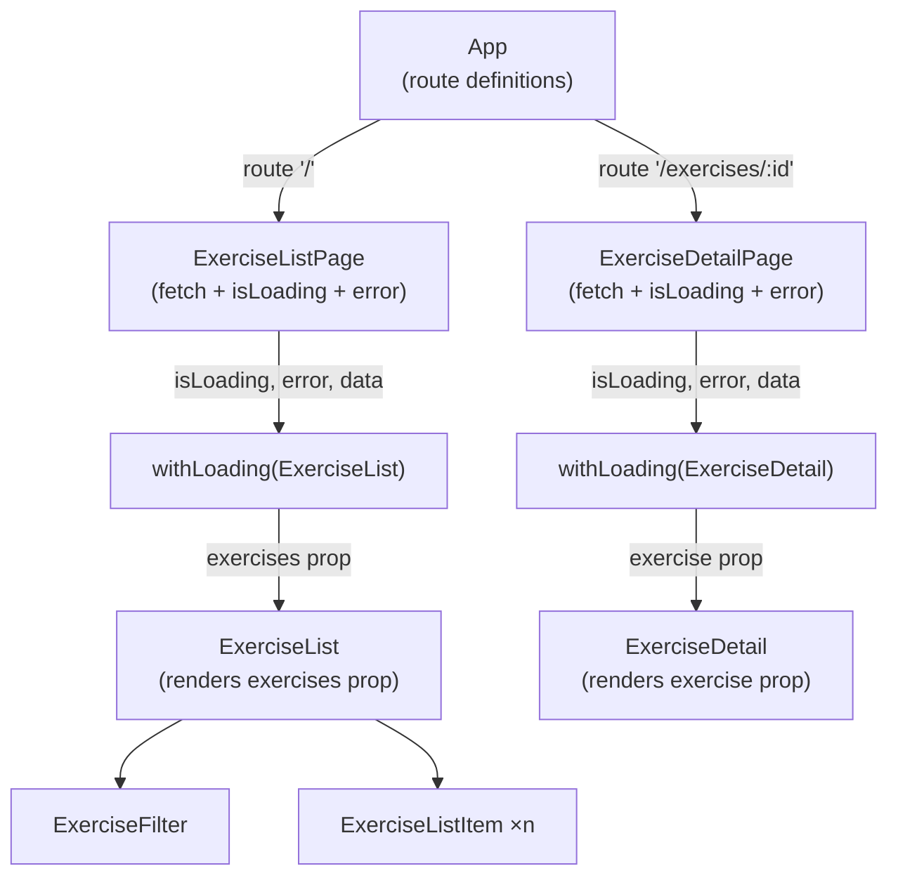

# Tractus Frontend

> **Phase 07 — Higher-Order Components** | Tractus Frontend · Web Dev Bootcamp

`ExerciseList` and `ExerciseDetail` both manage loading and error states.
The code is nearly identical: an `isLoading` flag, an `error` string, a skeleton
block, an error block, and finally the real content. Every new component that
fetches data will write it again. This phase removes the duplication — not by
refactoring, but by extracting the pattern into a higher-order component.

A higher-order component is a function that takes a component and returns a new
component. That is the entire mechanic. `withLoading` is one expression of it —
the concern it wraps happens to be loading and error state. The same mechanic
appears again in phase 09 as an auth guard, and it is the basis of many patterns
in the React ecosystem: permission wrappers, analytics trackers, feature flags.
The name changes. The shape does not.

> **A note on scope.** HOCs are not the only way to share logic in React. Hooks
> can extract stateful logic too, and are often the better tool. HOCs remain
> relevant for wrapping rendering concerns — adding behaviour around what a
> component displays, not just how it computes. We introduce HOCs here because
> the auth guard in phase 09 is most naturally expressed as one. Custom hooks
> will follow in a later phase.

---

## 🗺️ Contents

- [Branch sequence](#-branch-sequence)
- [Resolving the thought pieces](#-resolving-the-thought-pieces)
- [Why higher-order components](#-why-higher-order-components)
- [What we built in the previous branch](#-what-we-built-in-the-previous-branch)
- [What we're doing in this branch](#-what-were-doing-in-this-branch)
- [The abstraction we earned](#-the-abstraction-we-earned)
- [Learning goals](#-learning-goals)
- [Key concepts](#-key-concepts)
- [What to notice in the code](#-what-to-notice-in-the-code)
- [Running this branch](#-running-this-branch)
- [Challenges for students](#-challenges-for-students)
- [Thought pieces for the next branch](#-thought-pieces-for-the-next-branch)

---

## 📍 Branch sequence

| Branch | What it introduces | Abstraction level |
|---|---|---|
| `main` | Vite + React scaffold, no domain | Scaffold only |
| `phase-01_react_jsx-and-components` | JSX, first component, static render | Static markup |
| `phase-02_react_props-and-lists` | Props, component tree, rendering lists, keys | Hardcoded data |
| `phase-03_react_state-and-events` | `useState`, event handlers, local interactivity | Hardcoded data |
| `phase-04_react_effects-and-fetch` | `useEffect`, fetch, lifecycle, loading/error state | Live API data |
| `phase-05_routing_react-router` | React Router, multi-page SPA, route params, nav | Live API data |
| `phase-06_forms_controlled-inputs` | Controlled inputs, filter form, derived state | Live API data |
| `📌 phase-07_react_hoc-pattern` | **Higher-order components, `withLoading` wrapper** | Live API data |
| `phase-08_auth_keycloak-pkce` | Keycloak, auth code + PKCE, login/logout | Auth wall |
| `phase-09_auth_protected-routes` | HOC as auth guard, redirect to login, token header | Auth wall |
| `phase-10_sessions_crud` | Create session, session list, session detail | Auth + API |
| `phase-11_sessions_entries-and-done` | Add entries, mark done, progress indicator | Auth + API |
| `phase-12_state_redux` | Redux, global auth state, session state | Redux |

---

## ✅ Resolving the thought pieces

### `ExerciseList` now manages fetch state, retry state, and filter state — what would you extract first?

The fetch and loading pattern. Filter state is specific to the list; the
loading and error scaffolding is identical across every component that fetches
data. That is what we extract here — not with a refactor inside each component,
but with a wrapper that adds the behaviour from outside.

### The loading and error pattern is identical across `ExerciseList` and `ExerciseDetail` — what is the minimal abstraction?

A higher-order component. `withLoading` wraps any component and handles the
`isLoading` and `error` states on its behalf. The wrapped component receives
its data as a prop and renders it — no loading logic, no error handling. The
duplication disappears not by being rewritten but by being moved to one place.

### The filter works on data already in memory — when would client-side filtering be the wrong choice?

Still deferred — this is an API and backend design question more than a
frontend one. When pagination is introduced, the server must filter before
returning a page of results. The frontend change is small (add query params to
the fetch call); the backend change is larger. That friction belongs to a phase
where we are actively talking to a more capable API.

---

## 💡 Why higher-order components

In JavaScript, functions are first-class values — they can be passed as
arguments and returned as results. A higher-order component applies this
to React components: it is a function that accepts a component as an argument
and returns a new component as its result. The returned component renders the
original, but with additional behaviour wrapped around it.

This is not a React-specific idea. It is the same principle as a decorator, a
middleware, or a wrapper function in any language. React makes it natural because
components are just functions.

The mechanic has exactly three parts:

1. Accept a component as a parameter (by convention named `WrappedComponent`)
2. Define a new component that adds the desired behaviour
3. Return the new component

`withLoading` uses this mechanic to handle loading and error states. It
receives `isLoading`, `error`, and `data` as props, renders the appropriate
UI for each case, and passes `data` to `WrappedComponent` only when it is
ready. The wrapped component never sees `isLoading` or `error` — those are
the HOC's concern.

The same three-part mechanic, applied to a different concern, produces the
auth guard in phase 09: accept a component, check whether the user is
authenticated, redirect to login if not, render the component if so. The
loading wrapper and the auth guard look different on the surface and identical
underneath. That is the point.

---

## ⏮️ What we built in the previous branch

Phase 06 added a filter panel above the exercise list — a controlled text
input and a category dropdown. Filter state lives in `ExerciseList` alongside
the fetched data. The visible list is derived on every render. No new API
calls — the filter narrows what is already in memory.

---

## 🎯 What we're doing in this branch

- Create `withLoading` — a higher-order component that handles `isLoading`, `error`, and the success case
- Wrap `ExerciseList` with `withLoading` to remove its loading and error blocks
- Wrap `ExerciseDetail` with `withLoading` to remove its loading and error blocks
- Move the fetch call up to the page components so they can pass `isLoading`, `error`, and `data` as props

---

## 🏆 The abstraction we earned

> Higher-order components are the first pattern in this course that operates
> on components rather than on data. Every abstraction so far — service modules,
> controlled inputs, derived state — has been about how data flows. HOCs are
> about how components compose. A function that takes a component and returns a
> component is a seam: you can insert behaviour into the rendering pipeline
> without touching the component being wrapped. That seam is what makes the
> auth guard in phase 09 possible. It is also what makes third-party HOCs —
> Redux's `connect`, React Router's `withRouter` — work the way they do. Once
> you understand the mechanic, you can read any HOC you encounter and know
> exactly what it is doing.

---

## 🧑🏻‍🏫 Learning goals

### Understand
- **Explain** what a higher-order component is — a function that takes a component and returns a component.
- **Describe** how `withLoading` differs from a regular component and what problem it solves.

### Apply
- **Write** a higher-order component that wraps a component with additional behaviour.
- **Use** `withLoading` to remove loading and error logic from a fetching component.

### Analyze
- **Examine** the three-part HOC mechanic and identify it in both `withLoading` and the phase-09 auth guard.
- **Compare** the HOC approach to extracting the same logic into a shared helper function — what can a HOC do that a helper cannot?

### Evaluate
- **Assess** when a HOC is the right tool versus a custom hook — what is the difference in what each one wraps?

---

## 🔑 Key concepts

| Concept | Plain English |
|---|---|
| **Higher-order component (HOC)** | A function that takes a component and returns a new component. The returned component adds behaviour — loading states, auth checks, analytics — around the original. |
| **`WrappedComponent`** | The component passed into the HOC. The HOC renders it when the conditions are right (data is ready, user is authenticated, etc.). |
| **Rendering concern** | Behaviour that affects what is displayed — loading skeletons, error messages, redirect to login. HOCs are well suited to wrapping these. Compare to stateful logic (data fetching, form state), which is better extracted into a custom hook. |
| **Composition** | Building complex behaviour by combining simpler pieces. HOCs compose components the same way functions compose — the output of one can be the input of another. |

---

## 🔍 What to notice in the code

**[`src/hocs/withLoading.tsx`](src/hocs/withLoading.tsx)**
The entire HOC mechanic is visible here: a function that accepts a component,
defines a new component around it, and returns the new component. Read the
three parts explicitly — parameter, inner component, return statement.
Compare the shape of this file to the auth guard that appears in phase 09.

**[`src/pages/ExerciseListPage.tsx`](src/pages/ExerciseListPage.tsx)**
The fetch call has moved here from `ExerciseList`. The page now owns the
data lifecycle — it passes `isLoading`, `error`, and `exercises` as props
to the wrapped component. `ExerciseList` no longer knows whether data is
loading; it only knows how to render exercises it has been given.

**[`src/pages/ExerciseDetailPage.tsx`](src/pages/ExerciseDetailPage.tsx)**
Same pattern as `ExerciseListPage` — fetch logic moved to the page, the
detail component receives ready data as a prop.

**[`src/components/ExerciseList.tsx`](src/components/ExerciseList.tsx)**
Compare this file to the phase-06 version. The `isLoading`, `error`, and
`retryCount` state are gone. The skeleton and error blocks are gone. The
component receives `exercises` as a prop and renders them — nothing else.

**[`src/components/ExerciseDetail.tsx`](src/components/ExerciseDetail.tsx)**
Same transformation — loading and error state removed, data received as a prop.

**Component tree**



The page owns the lifecycle. The HOC owns the conditional rendering. The
component owns nothing but its own output. Three distinct responsibilities,
three distinct layers.

---

## ▶️ Running this branch

```bash
npm install
npm run dev
```

The backend must be running at `http://localhost:8080` (CORS-fix branch).

App runs at `http://localhost:5173`.

---

## ✏️ Challenges for students

**Challenge 1 — Analytical**
`withLoading` is described as wrapping a "rendering concern". What is the
difference between a rendering concern and a stateful concern? Give an example
of each and explain why that distinction matters when choosing between a HOC
and a custom hook.

**Challenge 2 — Analytical**
HOCs can be composed — `withAuth(withLoading(MyComponent))`. What would the
execution order be, and what would happen if the order were reversed?
When does composition order matter?

**Challenge 3 — Additive**
`withLoading` currently shows a generic skeleton. Extend it to accept an
optional `skeleton` prop so the caller can pass a custom loading UI.
When would a generic skeleton be insufficient?

**Challenge 4 — Additive**
Add a `displayName` to the component returned by `withLoading` so it appears
as `withLoading(ExerciseList)` in React DevTools rather than just `Component`.
Why does this matter in practice?

**Challenge 5 — Additive (stretch)**
Write a second HOC — `withErrorBoundary` — that catches rendering errors in
its wrapped component and displays a fallback UI instead of crashing the page.
React provides a specific API for this — find it in the documentation.

---

## 💭 Thought pieces for the next branch

1. The app currently has no login. Any user can reach any route. What would
   need to exist — in the frontend, in the API, and in an auth server — before
   you could restrict a route to authenticated users only?
2. Tokens carry identity. Where would a token live in a browser application,
   and why does the answer matter for security? What are the tradeoffs between
   storing it in memory, in `localStorage`, and in a cookie?
3. The HOC pattern keeps growing useful as the app gains features. What other
   cross-cutting concerns in this app — things that are not specific to exercises
   or sessions — might eventually be expressed as HOCs?

---

*Previous branch: [`phase-06_forms_controlled-inputs`]*
*Next branch: [`phase-08_auth_keycloak-pkce`]*
