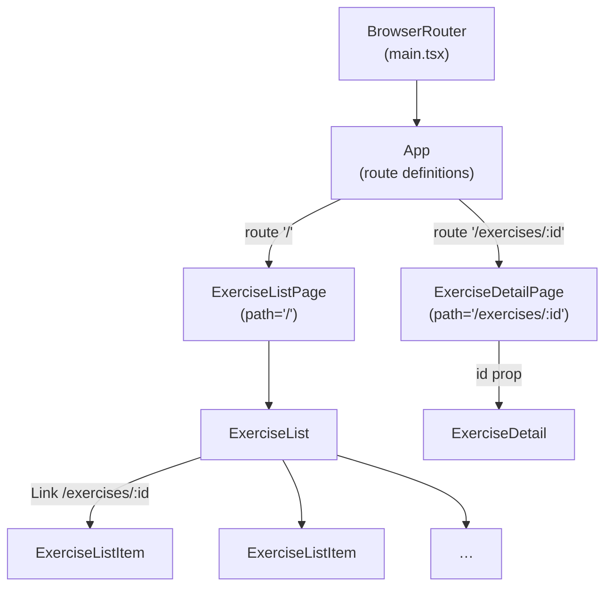

# Tractus Frontend

> **Phase 05 — Routing** | Tractus Frontend · Web Dev Bootcamp

React Router turns a single-page application into one that feels like a
multi-page website — with real URLs, back button support, and deep-linkable views.

The app so far is one screen. Clicking an exercise highlights it in a sidebar
panel, but the URL never changes. There is no way to link directly to an
exercise, no back button history, and no concept of "pages". React Router
changes all of that. Each view gets its own URL. Navigation becomes a first-class
concern. The component that renders depends on the route — not on local state.

This phase also resolves a structural issue from the previous solution: the
selected exercise was passed from `App` down to `ExerciseDetail` as a prop.
That works for two levels, but it is the beginning of prop drilling — threading
state through components that do not need it just to reach one that does.
React Router sidesteps this for navigation state by putting the selection in
the URL instead. The general problem of shared state across distant components
is addressed properly in phase 12 with Redux.

---

## 🗺️ Contents

- [Branch sequence](#-branch-sequence)
- [Resolving the thought pieces](#-resolving-the-thought-pieces)
- [Why React Router](#-why-react-router)
- [What we built in the previous branch](#-what-we-built-in-the-previous-branch)
- [What we're doing in this branch](#-what-were-doing-in-this-branch)
- [The abstraction we earned](#-the-abstraction-we-earned)
- [Learning goals](#-learning-goals)
- [Key concepts](#-key-concepts)
- [What to notice in the code](#-what-to-notice-in-the-code)
- [Running this branch](#-running-this-branch)
- [Challenges for students](#-challenges-for-students)
- [Thought pieces for the next branch](#-thought-pieces-for-the-next-branch)

---

## 📍 Branch sequence

| Branch | What it introduces | Abstraction level |
|---|---|---|
| `main` | Vite + React scaffold, no domain | Scaffold only |
| `phase-01_react_jsx-and-components` | JSX, first component, static render | Static markup |
| `phase-02_react_props-and-lists` | Props, component tree, rendering lists, keys | Hardcoded data |
| `phase-03_react_state-and-events` | `useState`, event handlers, local interactivity | Hardcoded data |
| `phase-04_react_effects-and-fetch` | `useEffect`, fetch, lifecycle, loading/error state | Live API data |
| `📌 phase-05_routing_react-router` | **React Router, multi-page SPA, route params, nav** | Live API data |
| `phase-06_forms_controlled-inputs` | Controlled inputs, filter form, form submission | Live API data |
| `phase-07_react_hoc-pattern` | Higher-order components, `withLoading` wrapper | Live API data |
| `phase-08_auth_keycloak-pkce` | Keycloak, auth code + PKCE, login/logout | Auth wall |
| `phase-09_auth_protected-routes` | HOC as auth guard, redirect to login, token header | Auth wall |
| `phase-10_sessions_crud` | Create session, session list, session detail | Auth + API |
| `phase-11_sessions_entries-and-done` | Add entries, mark done, progress indicator | Auth + API |
| `phase-12_state_redux` | Redux, global auth state, session state | Redux |

---

## ✅ Resolving the thought pieces

### A URL like `/exercises/123` — what would need to exist?

We resolve it here. React Router maps URL patterns to components. The pattern
`/exercises/:id` matches any exercise URL and makes the `id` segment available
to the component via `useParams`. The component fetches the exercise for that
ID and renders it. The URL is the state — no prop threading required.

### Prop drilling — state passed through components that don't need it

The phase-04 challenge solution passed `selectedExercise` from `App` down to
`ExerciseDetail`. Two levels is manageable; five levels is not. This is prop
drilling — and it is a real problem as the component tree grows. React Router
eliminates it for navigation state by replacing the sidebar panel with a
dedicated route. The general solution for other shared state (auth, session
data) is Redux, introduced in phase 12.

### Service module memory between calls

Still deferred. Two components calling the same service function independently
will fire two separate requests. That is inefficient but not broken. Caching
and request deduplication belong to a data-fetching library — the friction will
be clear enough by the time we reach that point.

---

## 💡 Why React Router

Without a router, the browser's URL never changes. Every view is produced by
local state — a boolean flag, a selected ID — and the URL stays the same
regardless of what the user is looking at. That means no bookmarks, no shared
links, no back button, and no way to land directly on a specific exercise.

React Router maps URL patterns to components. When the URL is `/`, render the
list. When the URL is `/exercises/123`, render the detail view for exercise 123.
The URL becomes the source of truth for what is on screen — not a state variable
in a component.

Without React Router we would manage URL changes with `window.history.pushState`
and `window.location` directly, parsing the pathname manually to decide what to
render. React Router automates that. By this point, having written the pattern
manually would be tedious enough that the library earns its place.

---

## ⏮️ What we built in the previous branch

Phase 04 replaced hardcoded data with a real fetch via `useEffect`. The app
shows a live list of exercises with loading, error, and success states. Clicking
an exercise passes the selection up to `App`, which renders `ExerciseDetail` as
a sidebar panel. The URL never changes.

---

## 🎯 What we're doing in this branch

- Install React Router and wrap the app in `BrowserRouter`
- Define routes in `App`: `/` for the list, `/exercises/:id` for the detail
- Remove the sidebar `ExerciseDetail` panel — detail is now a separate route
- Add `Link` to `ExerciseListItem` so clicking navigates rather than selects
- Create `ExerciseDetailPage` that reads the ID from `useParams` and fetches the exercise
- Remove `selectedExercise` state from `App` — the URL carries the selection now

---

## 🏆 The abstraction we earned

> React Router abstracts the browser's History API — the mechanism that lets
> JavaScript applications change the URL without a full page reload. Without it,
> every navigation would require `window.history.pushState`, manual URL parsing,
> and a custom mechanism to re-render the right component. React Router handles
> all of that and gives us a declarative API: define which component maps to
> which URL pattern, and the framework does the rest. The same principle applies
> here as everywhere else in this course — understand what the library is doing
> before you let it do it for you.

---

## 🧑🏻‍🏫 Learning goals

### Understand
- **Explain** what a single-page application is and how React Router simulates
  navigation without a full page reload.
- **Describe** why putting the selected exercise in the URL is better than
  keeping it in component state.

### Apply
- **Define** routes using `<Routes>` and `<Route>` and map them to components.
- **Use** `useParams` to read a URL segment inside a component.
- **Navigate** programmatically and declaratively using `Link` and `useNavigate`.

### Analyze
- **Examine** what the browser's History API does and identify where React
  Router sits on top of it.
- **Identify** what was lost by removing the sidebar panel and what was gained
  by giving the detail view its own URL.

### Evaluate
- **Assess** the tradeoff between URL-based state and component state — when
  should something live in the URL and when should it stay local?

---

## 🔑 Key concepts

| Concept | Plain English |
|---|---|
| **SPA** | Single-page application. One HTML file, JavaScript renders the UI. The browser never does a full reload — React Router intercepts navigation and swaps components instead. |
| **`BrowserRouter`** | The provider component that gives the rest of the app access to routing. Wraps the entire application, usually in `main.tsx`. |
| **`Routes` / `Route`** | Declarative route definitions. `<Route path="/exercises/:id" element={<ExerciseDetailPage />} />` maps a URL pattern to a component. |
| **Route param** | A named segment in a URL pattern (`:id`). React Router captures its value and makes it available via `useParams`. |
| **`useParams`** | A hook that returns the current route's params as an object. Inside `/exercises/:id`, `useParams().id` gives you the exercise ID. |
| **`Link`** | A component that renders an anchor tag but uses React Router's history instead of a full browser navigation. |
| **`useNavigate`** | A hook that returns a function for programmatic navigation — for when you need to navigate as a result of an event, not a click on a link. |
| **Prop drilling** | Passing state through intermediate components that do not use it, just to reach a deeply nested one. The URL eliminates it for navigation state. Redux eliminates it for shared application state (phase 12). |

---

## 🔍 What to notice in the code

**[`src/main.tsx`](src/main.tsx)**
`BrowserRouter` wraps the entire app here. This is where React Router's context
is established — every component inside can access routing hooks and respond to
URL changes.

**[`src/App.tsx`](src/App.tsx)**
Compare this file to the phase-04 version. The `selectedExercise` state is gone.
`App` no longer coordinates between components — it declares a route map and
nothing else. Two routes, two page components. That is its entire job.

**[`src/pages/ExerciseListPage.tsx`](src/pages/ExerciseListPage.tsx)**
A page component with no logic — it applies the layout and renders `ExerciseList`.
Pages own the shell; components own the content.

**[`src/components/ExerciseListItem.tsx`](src/components/ExerciseListItem.tsx)**
`onClick` is replaced by a `Link` to `/exercises/:id`. The component no longer
calls a callback — it navigates. The parent does not need to know a click
happened.

**[`src/pages/ExerciseDetailPage.tsx`](src/pages/ExerciseDetailPage.tsx)**
The page's only job is to read the URL param and pass the `id` to `ExerciseDetail`.
No fetch, no state, no rendering logic — just bridging the URL to the component.

**[`src/components/ExerciseDetail.tsx`](src/components/ExerciseDetail.tsx)**
Receives `id` as a prop and owns everything else: fetching the exercise, managing
loading and error states, rendering the card. The same fetch pattern as
`ExerciseList`, applied to a single resource.

**Component tree**



The router sits above `App` in the tree. `App` no longer holds state — it holds
routes. Pages bridge the URL to components; components own the logic and markup.
Note: component diagrams conventionally show structure only. The route paths and
Link labels are here because making the routing relationships explicit is the
point of this phase.

---

## 🌐 What the frontend revealed

`ExerciseDetailPage` needs `GET /exercises/:id`. If the backend does not expose
this endpoint, the detail page cannot load data — the list gives us IDs but no
way to retrieve a single exercise.

> **API LEARNING MOMENT:** Does `GET /exercises/:id` exist in the Tractus API?
> Check the Swagger UI at `http://localhost:8080/swagger-ui/index.html`. If it
> does not exist, what would the response shape need to look like, and what HTTP
> status should it return for an unknown ID?

---

## ▶️ Running this branch

```bash
npm install
npm run dev
```

The backend must be running at `http://localhost:8080` (CORS-fix branch).

App runs at `http://localhost:5173`.

---

## ✏️ Challenges for students

**Challenge 1 — Analytical**
Open the browser and navigate to an exercise detail page. Copy the URL and open
it in a new tab. What happens? Now try the same thing with the phase-04 version
where selection was local state. What is the fundamental difference, and why
does it matter for real applications?

**Challenge 2 — Analytical**
`useParams` returns `{ id: string | undefined }`. Why might `id` be undefined,
and how does `ExerciseDetailPage` handle that case? What would happen if you
did not guard against it?

**Challenge 3 — Analytical**
`App` no longer holds `selectedExercise` state. Where does the "which exercise
is selected" information live now? What are the tradeoffs of storing navigation
state in the URL versus in a component?

**Challenge 4 — Additive**
Add a catch-all route to `App` that renders a simple "Page not found" message
for any URL that does not match the defined routes. React Router has specific
syntax for this — check the documentation.

**Challenge 5 — Additive (stretch)**
The exercise list has no indication of which item the user last visited. Add an
`active` style to the `Link` in `ExerciseListItem` when its route is the current
URL. React Router provides a component that makes this straightforward — find it
in the documentation.

---

## 💭 Thought pieces for the next branch

1. The exercise list loads every time the user navigates back to `/`. There is
   no memory of the previous fetch — the data is re-requested on every visit.
   When would that be the right behaviour, and when would it be wasteful?
2. Both `ExerciseList` and `ExerciseDetail` now have their own loading and
   error states. As more components are added, this pattern will repeat. What would
   it take to avoid writing the same loading and error logic every time?
3. The app has exercises but no way to search or filter them. A user with a long
   exercise list has no choice but to scroll. What would a filter form need —
   and where in the component tree would it live?

---

*Previous branch: [`phase-04_react_effects-and-fetch`]*
*Next branch: [`phase-06_forms_controlled-inputs`]*
