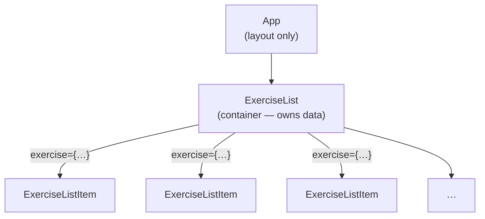

# Tractus Frontend

> **Phase 02 — Props and Lists** | Tractus Frontend · Web Dev Bootcamp

Phase 01 gave us a component — a function that returns JSX. But the component
had its data baked in. One component, one hardcoded exercise, nothing reusable.
This phase makes components useful: they receive data from outside via props,
and we use that to render a list of exercises from a hardcoded array.

We also introduce Tailwind CSS here — before the component tree grows any
further — so that every component we write from this point on is styled from
the start.

> **A note on scope.** The exercise data is still hardcoded in the component
> tree. Fetching it from the API comes in phase 04 once effects and lifecycle
> are introduced. For now, the focus is on the data flow between components —
> not where the data comes from.

---

## 🗺️ Contents

- [Branch sequence](#-branch-sequence)
- [Resolving the thought pieces](#-resolving-the-thought-pieces)
- [Why Tailwind](#-why-tailwind)
- [What we built in the previous branch](#-what-we-built-in-the-previous-branch)
- [What we're doing in this branch](#-what-were-doing-in-this-branch)
- [The abstraction we earned](#-the-abstraction-we-earned)
- [Learning goals](#-learning-goals)
- [Key concepts](#-key-concepts)
- [What to notice in the code](#-what-to-notice-in-the-code)
- [Running this branch](#-running-this-branch)
- [Challenges for students](#-challenges-for-students)
- [Thought pieces for the next branch](#-thought-pieces-for-the-next-branch)

---

## 📍 Branch sequence

| Branch | What it introduces | Abstraction level |
|---|---|---|
| `main` | Vite + React scaffold, no domain | Scaffold only |
| `phase-01_react_jsx-and-components` | JSX, first component, static render | Static markup |
| `📌 phase-02_react_props-and-lists` | **Props, component tree, rendering lists, keys** | Hardcoded data |
| `phase-03_react_state-and-events` | `useState`, event handlers, local interactivity | Hardcoded data |
| `phase-04_react_effects-and-fetch` | `useEffect`, fetch, lifecycle, loading/error state | Live API data |
| `phase-05_routing_react-router` | React Router, multi-page SPA, route params, nav | Live API data |
| `phase-06_forms_controlled-inputs` | Controlled inputs, filter form, form submission | Live API data |
| `phase-07_react_hoc-pattern` | Higher-order components, `withLoading` wrapper | Live API data |
| `phase-08_auth_keycloak-pkce` | Keycloak, auth code + PKCE, login/logout | Auth wall |
| `phase-09_auth_protected-routes` | HOC as auth guard, redirect to login, token header | Auth wall |
| `phase-10_sessions_crud` | Create session, session list, session detail | Auth + API |
| `phase-11_sessions_entries-and-done` | Add entries, mark done, progress indicator | Auth + API |
| `phase-12_state_redux` | Redux, global auth state, session state | Redux |

---

## ✅ Resolving the thought pieces

### One component, different data — that is what props are for

In phase 01, `ExerciseListItem` had one exercise hardcoded inside it. Rendering
ten different exercises would have meant ten separate component files, each
a near-identical copy. Props solve this: the parent holds the data and passes
it in, the component renders whatever it receives. One component definition,
any number of instances, each with its own data.

### Tailwind replaces the separate CSS files

The thought piece asked whether there was a better way to manage styles than
maintaining separate CSS files per component. There is — and we resolve it
here. Tailwind utility classes live directly in the JSX, alongside the markup
they style. No separate file, no class name to invent, no import to manage.

### React Developer Tools now shows props

In phase 01, the component tree had no data flowing through it — DevTools
was not much more than a tree view. Now that components receive props, select
any `ExerciseListItem` in the Components panel and observe the props displayed
on the right. This is the beginning of DevTools as a debugging tool: you can
see exactly what data a component received and verify it matches what you
expected.

### Layout components — deferred to phase 05

Where a shared header or navigation bar lives in the component tree is a
routing concern — it only makes sense once there are multiple pages to navigate
between. This is resolved in phase 05 when React Router is introduced.

### Testing — carried forward

Testing is deferred until there is enough app to make the tradeoffs concrete.
It will be addressed once the component tree has props, state, and API calls
in play.

---

## 💡 Why Tailwind

Styling with separate CSS files works but creates friction as the component
tree grows: every component needs its own file, its own class names, and an
import to wire them together. The styles live separately from the markup they
describe, which means context-switching between two files to understand one
component.

Tailwind puts the styles where the markup is. A utility class like `text-sm`
or `font-bold` is read directly in the JSX alongside the element it affects.
The component is self-contained — one file describes both structure and
appearance.

The alternative we considered was Bootstrap. Bootstrap gives you pre-built
components — buttons, cards, navbars — with an opinionated design system
attached. That is limiting: you are building inside Bootstrap's constraints
rather than composing your own design. Tailwind gives you utilities, not
components, so the design decisions remain yours.

The tradeoff worth naming: Tailwind utility classes are shorthand for CSS
properties you should know. `flex`, `justify-center`, and `gap-4` map
directly to `display: flex`, `justify-content: center`, and `gap: 1rem`.
The shorthand is convenient, but if a class name is unfamiliar, look up
the underlying property — that is what the browser is actually applying.

---

## ⏮️ What we built in the previous branch

Phase 01 produced a single `ExerciseListItem` component with one hardcoded
exercise and no styling. `App` rendered it directly. The build pipeline and
component model were established; the data flow and visual design were not.

---

## 🎯 What we're doing in this branch

- Install Tailwind CSS and remove the remaining plain CSS files
- Define an `Exercise` TypeScript type
- Add props to `ExerciseListItem` so it renders any exercise passed to it
- Create an `ExerciseList` component that renders a list of `ExerciseListItem` components
- Render `ExerciseList` from `App` — `ExerciseList` owns its own data
- Apply Tailwind classes throughout

---

## 🏆 The abstraction we earned

> Props decouple the component from its data. `ExerciseListItem` no longer
> knows or cares which exercise it is rendering — it renders whatever it
> receives. That single change transforms it from a one-off static file into
> a reusable piece. `ExerciseList` can now render ten exercises, a hundred,
> or zero — the component does not change, only the array passed to it does.

---

## 🧑🏻‍🏫 Learning goals

### Understand
- **Explain** what props are and how they flow through the component tree.
- **Describe** why React requires a `key` prop when rendering lists and what
  problem it solves.

### Apply
- **Pass** data into a component via props and render it.
- **Render** an array of items using `.map()` with a unique `key` on each element.
- **Use** Tailwind utility classes to style components without a separate CSS file.

### Analyze
- **Examine** the component tree in React Developer Tools and verify the props
  each component received match the data passed by its parent.
- **Identify** what would break if two items in a list shared the same `key`.

### Evaluate
- **Assess** the tradeoff between Tailwind and Bootstrap — in what kind of
  project might Bootstrap be the better choice?

---

## 🔑 Key concepts

| Concept | Plain English |
|---|---|
| **Props** | Data passed from a parent component to a child. The child receives them as a function argument and renders them. Props flow down — a child never passes data up to its parent through props. |
| **`key`** | A unique identifier React requires on each item when rendering a list. It lets React track which item is which across re-renders without re-rendering the whole list. |
| **`.map()`** | A JavaScript array method that transforms each item in an array into something else — in React, typically a JSX element. It returns a new array; it does not change the original. |
| **Type / Interface** | A TypeScript definition that describes the shape of an object. Lets the compiler catch a wrong or missing prop before the code runs. |
| **Tailwind utility class** | A single-purpose CSS class that applies one style rule. Composed directly in JSX rather than defined in a separate stylesheet. |
| **Container component** | A component that owns data or logic and passes it down to children. `ExerciseList` is a container — it knows about the exercise array and decides what to render. |
| **Presentational component** | A component that only renders what it receives via props. `ExerciseListItem` is presentational — it has no opinion about where its data comes from. |

---

## 🔍 What to notice in the code

**[`src/types/exercise.ts`](src/types/exercise.ts)**
The `Exercise` type defines the shape of the data flowing through the
component tree. Every prop typed as `Exercise` is checked against this
definition at compile time — a missing field or a typo in a property name
is a build error, not a runtime surprise.

**[`src/components/ExerciseListItem.tsx`](src/components/ExerciseListItem.tsx)**
Compare this file to the phase-01 version. The JSX structure is almost
identical — the only change is that the hardcoded values are replaced by
expressions in `{}` reading from the `exercise` prop. This is the pattern:
the component's shape is fixed, its data is variable.

**[`src/components/ExerciseList.tsx`](src/components/ExerciseList.tsx)**
The `.map()` call is the entire rendering logic. Each `ExerciseListItem`
gets a `key` and an `exercise` prop. Notice that `ExerciseList` does not
know what an exercise looks like — it only knows it has an array of them and
a component that can render one.

**[`src/App.tsx`](src/App.tsx)**
`App` is responsible for layout only — it renders `<ExerciseList />` with no
props and no knowledge of exercise data. Notice how little it does. That
simplicity is intentional: feature components own their data, `App` owns the
page structure.

**Component tree**



`App` knows nothing about exercises. `ExerciseList` knows about the array but
not what an individual exercise looks like. `ExerciseListItem` knows what an
exercise looks like but not where it came from. Each component has one
responsibility and one layer of knowledge.

The arrows carry the prop — data flows down. Nothing flows up. That is the
core rule of this phase.

---

## ▶️ Running this branch

```bash
npm install
npm run dev
```

App runs at `http://localhost:5173`. No backend required — all data is hardcoded.

---

## ✏️ Challenges for students

**Challenge 1 — Analytical**
Open React Developer Tools and select an `ExerciseListItem` in the component
tree. What props does it show? Now change one of the hardcoded exercise values
in `App.tsx` and save — what updates in the UI and in DevTools? What does this
tell you about when React re-renders a component?

**Challenge 2 — Analytical**
Remove the `key` prop from the `.map()` in `ExerciseList`. What warning appears
in the console? Read the warning carefully — what is React telling you, and why
does it need the key to manage a list efficiently?

**Challenge 3 — Additive**
Add a `siRisk` badge to `ExerciseListItem` that changes colour depending on
the value — green for `low`, yellow for `medium`, red for `high`. Use Tailwind
conditional classes. How do you decide which class to apply based on a prop value?

**Challenge 4 — Analytical**
The exercise data lives in `ExerciseList` rather than in `App`. Why? What
would have to change if two different parts of the UI needed the same exercise
data — a list view and a detail view, for example? Would `ExerciseList` still
be the right place to hold it?

**Challenge 5 — Additive (stretch)**
Add a second prop to `ExerciseListItem`: `isSelected` (boolean). When true,
render the item with a highlighted border. Render one item as selected in
`ExerciseList`. What will it take to make the selection interactive in a
later phase?

---

## 💭 Thought pieces for the next branch

1. The exercise list is static — it renders once and never changes. What if
   we wanted to let the user select an exercise, or toggle between a list view
   and a detail view? What would the component need that it does not have now?
2. The hardcoded array in `ExerciseList` is a stand-in for real API data. When we
   replace it with a fetch call, something has to happen between "the component
   mounts" and "the data arrives". What should the UI show during that gap?
3. Two components now share a relationship: `ExerciseList` knows about
   `ExerciseListItem`. As more components are added, how should we organise
   the `components` folder — and does it matter yet?
4. `ExerciseList` is a container — it owns the data and decides what to render.
   `ExerciseListItem` is presentational — it renders whatever it receives. This
   separation is deliberate, but it is not a rule. When does collapsing the two
   into a single component make more sense than keeping them separate? What
   would you lose if you did?

---

*Previous branch: [`phase-01_react_jsx-and-components`]*
*Next branch: [`phase-03_react_state-and-events`]*
