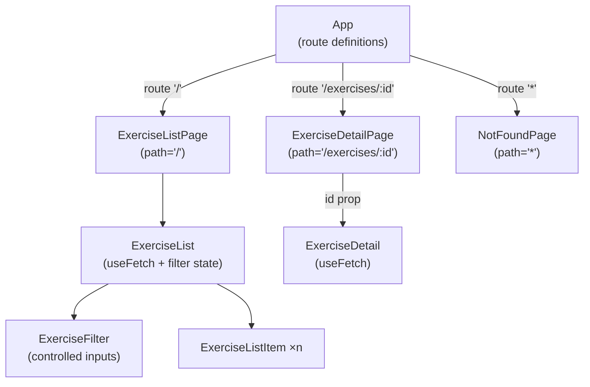

# Tractus Frontend

> **Phase 07 — Custom Hooks** | Tractus Frontend · Web Dev Bootcamp

`ExerciseList` and `ExerciseDetail` both manage loading and error states with
nearly identical code. The obvious fix was a higher-order component — a
`withLoading` wrapper that handles the conditional rendering so neither
component has to. We considered it, and rejected it. A HOC wraps rendering;
loading state is a stateful concern. Forcing the fetch logic up into page
components to feed a HOC would break the convention we established in phase 05:
page components are thin routing shells, not data containers. The HOC would
work, but the architecture around it would be wrong.

The right tool for extracting stateful logic is a custom hook. A custom hook
is a plain JavaScript function that calls React's built-in hooks internally
and returns whatever the calling component needs. It shares logic, not
rendering. The component stays in control of what it displays; the hook
handles the wiring it would otherwise repeat.

> **A note on scope.** Custom hooks are an intermediate-to-advanced topic.
> You are not expected to write them fluently after one phase — they are
> something you grow into over time as your intuition for hook behaviour
> deepens. This phase is an opportunity to see how hooks work from the inside.
> Writing one yourself is one of the clearest ways to understand what React is
> doing when you call `useState` or `useEffect` — and why the rules exist.
> HOCs are still a real pattern and will return in phase 09 as an auth guard,
> where wrapping rendering is genuinely the right fit.

---

## 🗺️ Contents

- [Branch sequence](#-branch-sequence)
- [Resolving the thought pieces](#-resolving-the-thought-pieces)
- [Why custom hooks over a HOC](#-why-custom-hooks-over-a-hoc)
- [What we built in the previous branch](#-what-we-built-in-the-previous-branch)
- [What we're doing in this branch](#-what-were-doing-in-this-branch)
- [The abstraction we earned](#-the-abstraction-we-earned)
- [Learning goals](#-learning-goals)
- [Key concepts](#-key-concepts)
- [What to notice in the code](#-what-to-notice-in-the-code)
- [Running this branch](#-running-this-branch)
- [Challenges for students](#-challenges-for-students)
- [Thought pieces for the next branch](#-thought-pieces-for-the-next-branch)

---

## 📍 Branch sequence

| Branch | What it introduces | Abstraction level |
|---|---|---|
| `main` | Vite + React scaffold, no domain | Scaffold only |
| `phase-01_react_jsx-and-components` | JSX, first component, static render | Static markup |
| `phase-02_react_props-and-lists` | Props, component tree, rendering lists, keys | Hardcoded data |
| `phase-03_react_state-and-events` | `useState`, event handlers, local interactivity | Hardcoded data |
| `phase-04_react_effects-and-fetch` | `useEffect`, fetch, lifecycle, loading/error state | Live API data |
| `phase-05_routing_react-router` | React Router, multi-page SPA, route params, nav | Live API data |
| `phase-06_forms_controlled-inputs` | Controlled inputs, filter form, derived state | Live API data |
| `📌 phase-07_react_custom-hooks` | **Custom hooks, `useFetch`, extracting stateful logic** | Live API data |
| `phase-08_auth_keycloak-pkce` | Keycloak, auth code + PKCE, login/logout | Auth wall |
| `phase-09_auth_protected-routes` | HOC as auth guard, redirect to login, token header | Auth wall |
| `phase-10_sessions_crud` | Create session, session list, session detail | Auth + API |
| `phase-11_sessions_entries-and-done` | Add entries, mark done, progress indicator | Auth + API |
| `phase-12_state_redux` | Redux, global auth state, session state | Redux |

---

## ✅ Resolving the thought pieces

### `ExerciseList` now manages fetch state, retry state, and filter state — what would you extract first?

The fetch and loading pattern — `isLoading`, `error`, the `useEffect` that
runs the request. Filter state is specific to `ExerciseList`; loading state
repeats across every component that fetches data. That is what we extract,
and we do it with a custom hook rather than a HOC. The distinction matters
and is explained in the next section.

### The loading and error pattern is identical across `ExerciseList` and `ExerciseDetail` — what is the minimal abstraction?

`useFetch`. A custom hook that takes a fetch function, runs it inside a
`useEffect`, and returns `{ data, isLoading, error }`. The calling component
destructures what it needs and uses the values directly — same as if it had
written the state itself, but without repeating the wiring.

### The filter works on data already in memory — when would client-side filtering be the wrong choice?

Still deferred. This is an API design question as much as a frontend one.
When the exercise list grows large enough that fetching everything upfront is
wasteful, the filter should pass query parameters to the API and let the server
return only matching records. The frontend change is small — add params to the
fetch call. The backend change is larger. That friction belongs to a phase where
we are actively building against a more capable API endpoint.

---

## 💡 Why custom hooks over a HOC

The repeated pattern in `ExerciseList` and `ExerciseDetail` is stateful logic:
`useState` for `isLoading`, `error`, and the fetched data; a `useEffect` that
runs the request and updates those values. A higher-order component could wrap
the conditional rendering — showing a skeleton or error message instead of the
component — but it cannot reach inside the component and remove the state that
drives those conditions. To make a HOC work cleanly, the fetch logic would have
to move up into the page components so they could pass `isLoading` and `error`
as props down through the HOC layer. Page components would become data containers.
That breaks the convention established in phase 05, and the cure would be worse
than the disease.

A custom hook solves the actual problem. It extracts the stateful logic —
the `useState` calls, the `useEffect`, the fetch — into a reusable function.
The component calls the hook and gets back `{ data, isLoading, error }`. Nothing
moves. The page components stay thin. The component stays in control of its own
rendering. The duplication disappears because the logic is in one place.

The `use` prefix is the signal that makes this work. When a function's name
starts with `use`, React treats it as a hook: it enforces the rules of hooks
inside it (no conditional calls, no calls inside loops), and the linter warns
if those rules are broken. Without the prefix, the same function is just a plain
JavaScript function — it may work in simple cases, but React will not protect
you when you use it incorrectly. The prefix is what opts the function into
hook semantics. It is a convention, not syntax — React looks for it by name.

Under the hood, a custom hook is nothing more than a function that calls other
hooks. When `useFetch` calls `useState`, React stores that state in the same
fiber slot system it uses for every other hook call — keyed to the component
instance and the call order. The state does not live inside the hook function.
It lives in React's internal tree. The hook is just the function that reads from
and writes to that slot. This is why custom hooks can hold state that survives
re-renders, even though the function itself runs fresh each time.

---

## ⏮️ What we built in the previous branch

Phase 06 added a filter panel to the exercise list — a controlled text input
and a category dropdown that narrow the visible exercises on every keystroke.
Filter state lives in `ExerciseList` alongside the fetched data. The visible
list is derived on every render without being stored in separate state.

---

## 🎯 What we're doing in this branch

- Write `useFetch` — a custom hook that takes a fetch function, manages `isLoading` and `error` state, and returns `{ data, isLoading, error }`
- Replace the fetch wiring in `ExerciseList` with a `useFetch` call
- Replace the fetch wiring in `ExerciseDetail` with a `useFetch` call
- Each component receives the same values it had before — nothing changes about what they render, only where the state comes from

---

## 🏆 The abstraction we earned

> Custom hooks are the idiomatic React answer to shared stateful logic. Every
> built-in hook — `useState`, `useEffect`, `useRef` — is itself just a function
> that reads from and writes to React's internal state tree. A custom hook
> composes those primitives into something reusable and named. The `use` prefix
> is the only thing that distinguishes a custom hook from a plain function, and
> that distinction is purely about enforcing the rules — not about any special
> runtime behaviour. Once that is clear, the pattern generalises immediately:
> any logic that involves hooks and repeats across components is a candidate
> for extraction. `useFetch` is the first. `useAuth` and `useSession` will
> follow in later phases.

---

## 🧑🏻‍🏫 Learning goals

### Understand
- **Explain** what a custom hook is and what the `use` prefix signals to React.
- **Describe** why the `use` prefix is a convention and not special syntax, and what React uses it for.

### Apply
- **Write** a custom hook that composes `useState` and `useEffect` into a reusable fetch function.
- **Replace** repeated stateful logic in two components with a single hook call.

### Analyze
- **Examine** where state actually lives when a custom hook calls `useState` — is it inside the hook or inside the component?
- **Compare** a custom hook and a higher-order component — what does each one extract, and what does each one leave in place?

### Evaluate
- **Assess** when extracting logic into a custom hook is worth the indirection — what signals that logic is ready to be extracted?

---

## 🔑 Key concepts

| Concept | Plain English |
|---|---|
| **Custom hook** | A plain JavaScript function whose name starts with `use` and that calls React hooks internally. It extracts stateful logic so components do not repeat it. |
| **`use` prefix** | The naming convention that tells React (and its linter) to enforce hook rules inside the function. Without it, the same code is just a function — React will not warn you if you misuse it. |
| **Stateful logic** | Logic that involves state — `useState`, `useEffect`, derived values from state. Custom hooks extract this. Compare to rendering logic (what is displayed), which HOCs wrap. |
| **Hook slot** | React's internal storage for a hook's state, keyed to the component instance and the order of hook calls. The state lives here — not inside the hook function itself. |
| **Composition** | Building a custom hook by combining built-in hooks. `useFetch` composes `useState` and `useEffect`. More complex hooks compose other custom hooks. |

---

## 🔍 What to notice in the code

**[`src/hooks/useFetch.ts`](src/hooks/useFetch.ts)**
Read this file in three parts: the `useState` calls that define the slots, the
`useEffect` that runs the fetch and writes to those slots, and the return value
that hands the current slot values back to the caller. There is no special
mechanism — it is the same code that was inside each component, moved into a
named function. The `use` prefix is the only thing that makes it a hook.

**[`src/components/ExerciseList.tsx`](src/components/ExerciseList.tsx)**
Compare this to the phase-06 version. The `useState` calls for `isLoading`,
`error`, and the fetch data are gone, replaced by a single `useFetch` call.
The filter state remains — it belongs to this component and is not shared.

**[`src/components/ExerciseDetail.tsx`](src/components/ExerciseDetail.tsx)**
The same transformation — three state variables and a `useEffect` replaced by
one hook call. The rendering is identical to phase-06; only the source of the
data changed.

**Component tree**



The component tree is unchanged from phase 06. Custom hooks are invisible in
the tree — they are not components, they leave no node. The change is entirely
inside `ExerciseList` and `ExerciseDetail`.

---

## ▶️ Running this branch

```bash
npm install
npm run dev
```

The backend must be running at `http://localhost:8080` (CORS-fix branch).

App runs at `http://localhost:5173`.

---

## ✏️ Challenges for students

**Challenge 1 — Analytical**
`useFetch` calls `useState` inside it. Where does that state actually live —
inside the hook function, or somewhere else? What does your answer tell you
about why custom hooks can hold state across re-renders even though the function
runs fresh each time?

**Challenge 2 — Analytical**
`ExerciseList` still manages its own filter state — that was not moved into
`useFetch`. Why not? What is the difference between the fetch logic that was
extracted and the filter logic that was not?

**Challenge 3 — Additive**
`useFetch` currently has no way to retry a failed request. Add a `retry`
function to its return value that re-runs the fetch. How does this compare
to the `retryCount` pattern used before `useFetch` existed?

**Challenge 4 — Analytical**
The `use` prefix is a convention, not syntax. What happens if you rename
`useFetch` to `fetchData` and call it inside a component? Try it — what does
the linter say, and why?

**Challenge 5 — Additive (stretch)**
Write a second custom hook — `useDebounce(value, delay)` — that returns a
debounced version of any value. Wire it into the `ExerciseList` filter so the
list only updates 300ms after the user stops typing. This is the debounce
technique flagged in phase 06 — now the hook pattern makes it composable.

---

## 💭 Thought pieces for the next branch

1. The app currently has no login. Any user can reach any route. What would
   need to exist — in the frontend, in the API, and in an auth server — before
   you could restrict a route to authenticated users only?
2. Tokens carry identity. Where would a token live in a browser application,
   and why does the answer matter for security? What are the tradeoffs between
   storing a token in memory, in `localStorage`, and in a cookie?
3. `useFetch` fires a new request every time the component mounts. If the user
   navigates away and back, the list re-fetches. What would a caching layer
   need to do to prevent that, and at what point does it become complex enough
   to justify a dedicated library?

---

*Previous branch: [`phase-06_forms_controlled-inputs`]*
*Next branch: [`phase-08_auth_keycloak-pkce`]*
