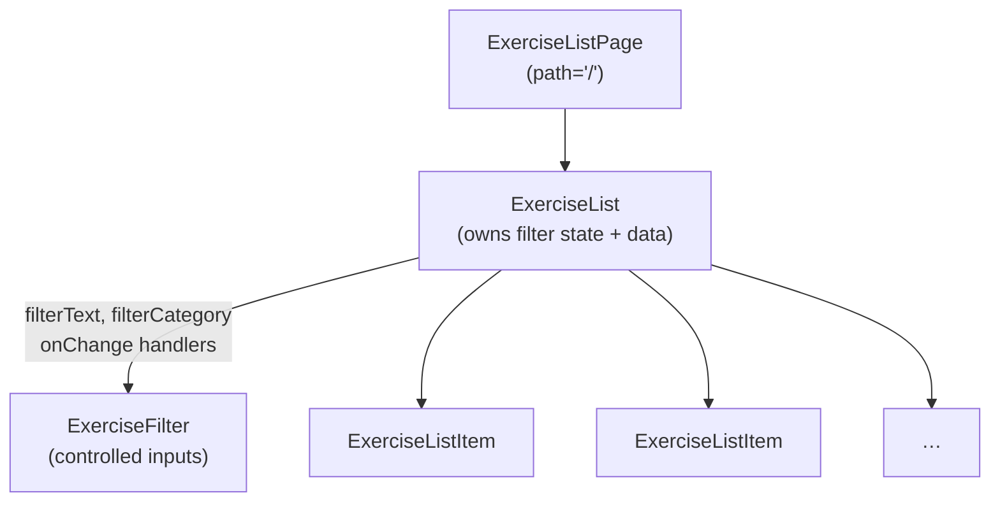

# Tractus Frontend

> **Phase 06 — Forms** | Tractus Frontend · Web Dev Bootcamp

The exercise list works, but it has no way to narrow down. A user with
fifty exercises has no choice but to scroll through all of them. This phase
adds a filter panel above the list — a text input for name and a dropdown
for category. As the user types or selects, the list updates immediately.

The mechanism is the controlled input. React owns the value of every input
in this phase — not the DOM. That single decision is what makes the
filtered list update automatically on every keystroke, with no need to reach
into the DOM to read what the user typed.

---

## 🗺️ Contents

- [Branch sequence](#-branch-sequence)
- [Resolving the thought pieces](#-resolving-the-thought-pieces)
- [Why controlled inputs](#-why-controlled-inputs)
- [What we built in the previous branch](#-what-we-built-in-the-previous-branch)
- [What we're doing in this branch](#-what-were-doing-in-this-branch)
- [The abstraction we earned](#-the-abstraction-we-earned)
- [Learning goals](#-learning-goals)
- [Key concepts](#-key-concepts)
- [What to notice in the code](#-what-to-notice-in-the-code)
- [Running this branch](#-running-this-branch)
- [Challenges for students](#-challenges-for-students)
- [Thought pieces for the next branch](#-thought-pieces-for-the-next-branch)

---

## 📍 Branch sequence

| Branch | What it introduces | Abstraction level |
|---|---|---|
| `main` | Vite + React scaffold, no domain | Scaffold only |
| `phase-01_react_jsx-and-components` | JSX, first component, static render | Static markup |
| `phase-02_react_props-and-lists` | Props, component tree, rendering lists, keys | Hardcoded data |
| `phase-03_react_state-and-events` | `useState`, event handlers, local interactivity | Hardcoded data |
| `phase-04_react_effects-and-fetch` | `useEffect`, fetch, lifecycle, loading/error state | Live API data |
| `phase-05_routing_react-router` | React Router, multi-page SPA, route params, nav | Live API data |
| `📌 phase-06_forms_controlled-inputs` | **Controlled inputs, filter form, derived state** | Live API data |
| `phase-07_react_hoc-pattern` | Higher-order components, `withLoading` wrapper | Live API data |
| `phase-08_auth_keycloak-pkce` | Keycloak, auth code + PKCE, login/logout | Auth wall |
| `phase-09_auth_protected-routes` | HOC as auth guard, redirect to login, token header | Auth wall |
| `phase-10_sessions_crud` | Create session, session list, session detail | Auth + API |
| `phase-11_sessions_entries-and-done` | Add entries, mark done, progress indicator | Auth + API |
| `phase-12_state_redux` | Redux, global auth state, session state | Redux |

---

## ✅ Resolving the thought pieces

### The exercise list loads every time the user navigates back to `/` — when is that right?

Still the case, and deliberately so. The filter resets on navigation too — a
fresh visit to the list gives you the full unfiltered list. For an exercise
catalogue that changes rarely, re-fetching every visit is wasteful but not
broken. When the cost becomes visible — a slow network, a long list, a user
who navigates back constantly — caching belongs to a data-fetching library.
The friction will be clear enough when we reach it.

### Both `ExerciseList` and `ExerciseDetail` have their own loading and error states — what would it take to avoid repeating that logic?

Still deferred. This phase adds more state to `ExerciseList` and makes the
duplication more obvious. That friction is the setup for phase 07, where a
higher-order component extracts the shared pattern once and applies it to
any component that fetches data.

### The app has exercises but no way to search or filter them — what would a filter form need, and where would it live?

We resolve it here. The filter needs two inputs — a text field for name and
a dropdown for category — and their values need to be accessible wherever
the filtering logic runs. Both live in `ExerciseList`, alongside the data
they operate on.

---

## 💡 Why controlled inputs

There are three approaches to forms in React, each a step further from the DOM.

**Uncontrolled inputs** let the DOM own the value. You read it with a ref
(`inputRef.current.value`) when you need it — typically on submit. Simple to
set up, but hard to compose: derived state requires querying the DOM on demand,
and there is no automatic re-render when the value changes.

**Controlled inputs** put the value in React state. The `value` prop sets what
the input displays; `onChange` fires on every keystroke and keeps state in sync.
Because the filter values are now just state variables, the filtered list is a
derived computation — an `.filter()` call that runs on every render. No DOM
reads, no side effects. This is what we build in this phase.

**Form libraries** (React Hook Form, for example) sit above both. They manage
controlled inputs under the hood, add validation, track dirty and touched state,
and hand you a clean form object on submit — without you wiring up `onChange`
for every field. When a form grows beyond a few inputs, this is where the
boilerplate becomes painful enough to justify the library. We will use React
Hook Form when we build the session creation form in phase 10. By then, having
written the wiring by hand, the library will make immediate sense.

This phase uses controlled inputs. The goal is to understand what the library
is doing before we let it do it.

---

## ⏮️ What we built in the previous branch

Phase 05 added React Router. The app now has real URLs — `/` for the list
and `/exercises/:id` for the detail view. Clicking an exercise navigates
rather than selecting. The URL is the state. Page components bridge the URL
to the components that own the logic.

---

## 🎯 What we're doing in this branch

- Add an `ExerciseFilter` component with a controlled text input and a controlled category dropdown
- Filter state (`filterText`, `filterCategory`) lives in `ExerciseList` alongside the data it filters
- Derive the visible list from the full exercise array and the current filter values on each render
- Pass filter values and `onChange` handlers down to `ExerciseFilter` as props

---

## 🏆 The abstraction we earned

> Controlled inputs are not a React-specific idea — they are the general
> principle of single source of truth applied to form fields. The DOM has
> always had its own opinion about what an input contains; controlled inputs
> override that opinion and hand authority to the application. Once the value
> lives in state, everything that depends on it — validation, derived lists,
> conditional UI — becomes a straightforward computation rather than a DOM
> query. The cost is boilerplate: every input needs a `value` and an
> `onChange`. That cost is why form libraries exist. By this point, having
> written the wiring by hand, the library will make immediate sense.

---

## 🧑🏻‍🏫 Learning goals

### Understand
- **Explain** the difference between a controlled and an uncontrolled input.
- **Describe** what derived state is and why it does not need its own `useState`.

### Apply
- **Wire up** a controlled input with `value` and `onChange`.
- **Derive** a filtered list from state without storing the filtered result in state.

### Analyze
- **Examine** where filter state lives and explain why that component is the right owner.
- **Identify** when uncontrolled inputs are the better choice.

### Evaluate
- **Assess** the tradeoff between controlled and uncontrolled inputs for different form scenarios.

---

## 🔑 Key concepts

| Concept | Plain English |
|---|---|
| **Controlled input** | An input whose value is set by a React state variable via the `value` prop. `onChange` keeps state in sync on every keystroke. React is the single source of truth. |
| **Uncontrolled input** | An input whose value lives in the DOM. Read via a ref when needed — not on every keystroke. Simpler to set up; harder to compose. |
| **`onChange`** | The event handler fired on every input change. Receives a `SyntheticEvent`; read the current value from `event.target.value`. |
| **Derived state** | A value computed from existing state on each render. The filtered exercise list is derived — it does not need its own `useState`, just a `.filter()` call before the return. |
| **`select` element** | The HTML dropdown. Works like a controlled input — give it a `value` and an `onChange`, and React owns the selection. |

---

## 🔍 What to notice in the code

**[`src/components/ExerciseFilter.tsx`](src/components/ExerciseFilter.tsx)**
A presentational component — no state of its own. It receives the current filter
values and the `onChange` handlers as props and renders two inputs. The parent
owns the state; this component only renders the controls and reports changes.

**[`src/components/ExerciseList.tsx`](src/components/ExerciseList.tsx)**
Filter state sits here alongside the fetched data, because this is where both
are needed to compute what gets rendered. Before mapping over exercises, a
`.filter()` call derives the visible subset. No new `useState` for the filtered
list — it is computed fresh on every render from the values that are already
in state.

**Component tree**



`ExerciseList` is the container — it holds state and passes it down.
`ExerciseFilter` is presentational — it renders inputs and reports changes
upward via callbacks. The same container/presentational split introduced in
phase 02 applied to a form.

---

## ▶️ Running this branch

```bash
npm install
npm run dev
```

The backend must be running at `http://localhost:8080` (CORS-fix branch).

App runs at `http://localhost:5173`.

---

## ✏️ Challenges for students

**Challenge 1 — Analytical**
The filter resets every time the user navigates away and returns. Why?
What would need to change to preserve the filter across navigation?
Would you store the filter in component state, the URL, or somewhere else?

**Challenge 2 — Analytical**
The text filter matches on `exercise.name`. What other fields would be
useful to search across, and what are the tradeoffs of matching on multiple
fields simultaneously?

**Challenge 3 — Additive**
Add a clear button that resets both inputs to their default values with a
single click.

**Challenge 4 — Additive**
Add a result count below the filter that shows "Showing X of Y exercises".
Where does this value come from — does it need its own state, or is it
already available?

**Challenge 5 — Additive (stretch)**
The text input has no associated `<label>` element — only a placeholder.
Add a proper label and wire it to the input with `htmlFor` and `id`.
Why does this matter beyond visual styling?

---

## 💭 Thought pieces for the next branch

1. `ExerciseList` now manages fetch state, retry state, and filter state.
   As more behaviour is added, a component that does this much becomes hard
   to read and test. What would you extract first, and how?
2. The loading and error pattern in `ExerciseList` and `ExerciseDetail` is
   identical — `isLoading`, `error`, the same conditional returns. Every new
   component that fetches data will repeat it. What is the minimal abstraction
   that removes the duplication without hiding what is happening?
3. The filter works on data already in memory — all exercises were fetched
   upfront and the filter narrows that set client-side. The alternative is to
   pass filter values as query parameters to the API (`GET /exercises?name=squat`)
   and let the server return only the matching records. When would client-side
   filtering be the wrong choice, and what would the frontend need to change to
   support server-side filtering instead?
4. The filter triggers a re-render on every keystroke. For a slow operation or
   a very large list, debouncing — delaying the computation until the user has
   stopped typing — is the standard fix. What React primitive would you use to
   implement it, and when is the cost actually worth paying?

---

*Previous branch: [`phase-05_routing_react-router`]*
*Next branch: [`phase-07_react_hoc-pattern`]*
