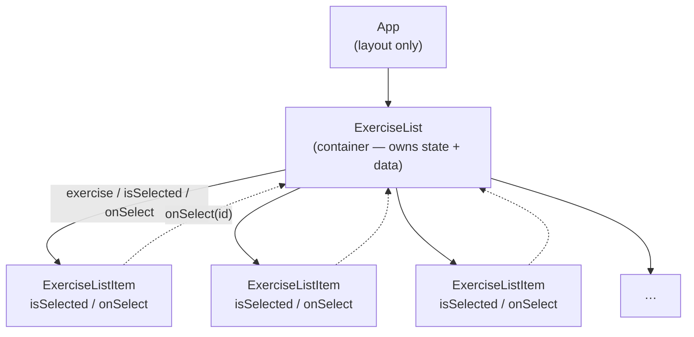

# Tractus Frontend

> **Phase 03 — State and Events** | Tractus Frontend · Web Dev Bootcamp

`useState` and event handlers give components memory and the ability to respond
to user interaction.

Phase 02 gave us a reusable component that renders any exercise passed to it.
But the list was static — it rendered once and stayed the same regardless of
what the user did. Components without state are display-only; they cannot
respond to interaction, remember a choice, or show anything different based on
what has happened. This phase adds the missing capability: a component can now
hold a value, respond to a user action, and update what it shows.

The interaction is deliberately small — click an exercise to select it, click
again to deselect. One piece of state, one event handler, one visual response.
That is enough to introduce the full cycle: state is declared, an event
triggers an update, React re-renders, the UI reflects the new state.

> **A note on scope.** State here is local — it lives in one component and is
> not shared across the app. Global state management comes in phase 12. The
> focus for now is understanding what state does and where it should live before
> introducing anything that abstracts it.

---

## 🗺️ Contents

- [Branch sequence](#-branch-sequence)
- [Resolving the thought pieces](#-resolving-the-thought-pieces)
- [Why state lives in the parent](#-why-state-lives-in-the-parent)
- [What we built in the previous branch](#-what-we-built-in-the-previous-branch)
- [What we're doing in this branch](#-what-were-doing-in-this-branch)
- [The abstraction we earned](#-the-abstraction-we-earned)
- [Learning goals](#-learning-goals)
- [Key concepts](#-key-concepts)
- [What to notice in the code](#-what-to-notice-in-the-code)
- [Running this branch](#-running-this-branch)
- [Challenges for students](#-challenges-for-students)
- [Thought pieces for the next branch](#-thought-pieces-for-the-next-branch)

---

## 📍 Branch sequence

| Branch | What it introduces | Abstraction level |
|---|---|---|
| `main` | Vite + React scaffold, no domain | Scaffold only |
| `phase-01_react_jsx-and-components` | JSX, first component, static render | Static markup |
| `phase-02_react_props-and-lists` | Props, component tree, rendering lists, keys | Hardcoded data |
| `📌 phase-03_react_state-and-events` | **`useState`, event handlers, local interactivity** | Hardcoded data |
| `phase-04_react_effects-and-fetch` | `useEffect`, fetch, lifecycle, loading/error state | Live API data |
| `phase-05_routing_react-router` | React Router, multi-page SPA, route params, nav | Live API data |
| `phase-06_forms_controlled-inputs` | Controlled inputs, filter form, form submission | Live API data |
| `phase-07_react_hoc-pattern` | Higher-order components, `withLoading` wrapper | Live API data |
| `phase-08_auth_keycloak-pkce` | Keycloak, auth code + PKCE, login/logout | Auth wall |
| `phase-09_auth_protected-routes` | HOC as auth guard, redirect to login, token header | Auth wall |
| `phase-10_sessions_crud` | Create session, session list, session detail | Auth + API |
| `phase-11_sessions_entries-and-done` | Add entries, mark done, progress indicator | Auth + API |
| `phase-12_state_redux` | Redux, global auth state, session state | Redux |

---

## ✅ Resolving the thought pieces

### The list is static — what would it take to make it interactive?

A component needs state. Without state, a component is a pure function of its
props — given the same input it always produces the same output. `useState`
gives it memory: a value that persists across re-renders and causes a new render
when it changes. That is what the list was missing. We resolve it here — clicking
an exercise sets a `selectedId` in state, and React re-renders the list to
reflect the change.

### What should the UI show while data is loading?

Deferred to phase 04. Loading and error states only become necessary when we
introduce `useEffect` and a real fetch call. Seeding the question here is the
right move — the answer lands where it belongs.

### How should we organise the `components` folder?

Still deferred. Two components do not warrant a folder strategy. When we add a
form component in phase 06, the tension will be real enough to make the
tradeoff concrete. Until then, flat is fine.

### When does collapsing container and presentational into one component make sense?

We keep them separate here, and the reason becomes clearer in this phase:
`ExerciseList` now holds `selectedId` in state and passes both `isSelected`
and `onSelect` down to each `ExerciseListItem`. If the selection logic lived
inside each item, there would be no way to enforce "only one selected at a
time" — each item would track its own state independently. State that affects
multiple siblings belongs in their common parent.

---

## 💡 Why state lives in the parent

The selected exercise ID could have lived inside `ExerciseListItem`. Each item
would track whether it was selected. But then two items could be selected
simultaneously — there is nothing to coordinate between them. To enforce a
single selection, the state must live somewhere that can see all the items at
once. That is the common parent: `ExerciseList`.

This is the general rule: lift state to the lowest common ancestor of every
component that needs it. Here that is `ExerciseList`. In a later phase, when
selected exercises need to be visible outside the list entirely, the state will
need to move again — higher up the tree, or into a shared store.

---

## ⏮️ What we built in the previous branch

Phase 02 produced a component tree: `App` renders `ExerciseList`, which renders
a list of `ExerciseListItem` components via `.map()`. Each item receives an
`exercise` prop and renders it. Tailwind handles all styling. The list was fully
reusable but entirely static — no user interaction, no state.

---

## 🎯 What we're doing in this branch

- Add `useState` to `ExerciseList` to track the ID of the selected exercise
- Extend the `ExerciseListItem` Props interface with `isSelected` and `onSelect`
- Pass `isSelected` and `onSelect` from `ExerciseList` to each `ExerciseListItem`
- Add an `onClick` handler in `ExerciseListItem` that calls `onSelect`
- Apply conditional Tailwind styling to highlight the selected item

---

## 🏆 The abstraction we earned

> `useState` turns a component from a pure display function into a participant
> in the application. It can now hold a value, respond to what the user does,
> and decide what to show based on its own history. The re-render cycle —
> state changes, React re-renders, UI updates — is the engine underneath every
> interactive React application. Every hook, every state library, every form
> input you will encounter from here on is built on top of this cycle.

---

## 🧑🏻‍🏫 Learning goals

### Understand
- **Explain** what `useState` returns and what happens when the setter is called.
- **Describe** why React re-renders a component when state changes and what
  determines which components are affected.

### Apply
- **Use** `useState` to track a single piece of local state in a component.
- **Wire** an event handler to a user interaction and update state in response.
- **Pass** a callback function as a prop and call it from a child component.

### Analyze
- **Examine** why `selectedId` lives in `ExerciseList` rather than in
  `ExerciseListItem` — trace what would break if it were moved.
- **Trace** the full re-render cycle: user clicks → handler fires → state updates
  → component re-renders → UI reflects new state.

### Evaluate
- **Assess** the tradeoff between keeping state local and lifting it to a parent —
  what do you gain and what do you give up in each case?

---

## 🔑 Key concepts

| Concept | Plain English |
|---|---|
| **`useState`** | A React hook that adds a piece of state to a component. Returns the current value and a setter function. Calling the setter triggers a re-render. |
| **Re-render** | React re-running the component function and updating the DOM to match the new output. Happens automatically when state or props change. |
| **Event handler** | A function attached to a user interaction — a click, a keystroke, a form submission. In React, event handlers are passed as props (`onClick`, `onChange`, etc.). |
| **Callback prop** | A function passed from a parent to a child as a prop. The child calls it to tell the parent something happened — the only way data moves up the tree. |
| **Conditional rendering** | Deciding what to render based on a value — a prop, a piece of state, or a derived expression. In JSX this is usually a ternary or a template string. |
| **Lifting state** | Moving state up to a common ancestor so that multiple children can read or influence it. The rule: state lives at the lowest level that can see everyone who needs it. |

---

## 🔍 What to notice in the code

**[`src/components/ExerciseList.tsx`](src/components/ExerciseList.tsx)**
This is where `useState` appears for the first time. Notice that `selectedId`
is `string | null` — null means nothing is selected, a string means one exercise
is. The setter is passed down as `onSelect`; `ExerciseList` does not handle the
click itself, it delegates that to the child and reacts to the result.

**[`src/components/ExerciseListItem.tsx`](src/components/ExerciseListItem.tsx)**
Two new props: `isSelected` (boolean) and `onSelect` (function). The component
does not know what selecting means — it just calls `onSelect` when clicked and
applies a different style when `isSelected` is true. This is the presentational
component pattern holding: the child renders what it receives and reports what
happened; the parent decides what to do with it.

**Component tree**



Solid arrows are props flowing down. Dashed arrows are the callback firing up.
This is the complete picture of data flow in a React component tree — props
down, callbacks up, state at the common ancestor.

Note: component diagrams conventionally show structure only — the boxes and
their relationships. The prop and callback labels on the arrows are here
because this is a learning context and making the data flow explicit is the
point. You would not normally annotate a diagram this way in production
documentation.

---

## ▶️ Running this branch

```bash
npm install
npm run dev
```

App runs at `http://localhost:5173`. No backend required — all data is hardcoded.

---

## ✏️ Challenges for students

**Challenge 1 — Analytical**
Open React Developer Tools and select `ExerciseList` in the component tree.
Find where its state is displayed. Click an exercise in the UI — what changes
in the DevTools panel? Now click the same exercise again — what happens? Trace
what is happening in the code each time.

**Challenge 2 — Analytical**
`selectedId` is `string | null`. Why `null` rather than an empty string `""`
to represent "nothing selected"? What is the practical difference, and which
is clearer when you read the conditional in `ExerciseListItem`?

**Challenge 3 — Analytical**
The `onSelect` prop is a function. What type does TypeScript infer for it?
Open the Props interface in `ExerciseListItem` and read how it is typed. What
does `(id: string) => void` mean, and what would break if you removed the type
annotation?

**Challenge 4 — Additive**
Add a deselect behaviour: if the user clicks the already-selected exercise,
clear the selection. What is the minimal change inside the `onSelect` handler
to support this? What condition do you check?

**Challenge 5 — Additive (stretch)**
Add a small info panel below the list that shows the name and category of the
selected exercise, or a placeholder when nothing is selected. The panel should
live in `ExerciseList` — not in `ExerciseListItem`. What state do you need to
pass to it, and what does this reveal about where state needs to live as more
of the UI depends on it?

---

## 💭 Thought pieces for the next branch

1. State is local — it lives in the component and disappears when the component
   unmounts. What happens to the selected exercise if the user navigates away
   and comes back? Is losing that selection on navigation acceptable? What would
   you need to preserve it?
2. `ExerciseList` still holds hardcoded exercise data. When we replace it with a
   real fetch call, the component will pass through at least three distinct
   states: before the request fires, while it is in flight, and after it
   settles (success or error). How should the UI handle each of those states?
3. The `onSelect` callback is one level deep — `ExerciseList` passes it to
   `ExerciseListItem`. What if a deeply nested child needed to trigger the same
   action? Would you thread the callback through every level in between? What
   is the cost of that, and what might be a better approach?

---

*Previous branch: [`phase-02_react_props-and-lists`]*
*Next branch: [`phase-04_react_effects-and-fetch`]*
